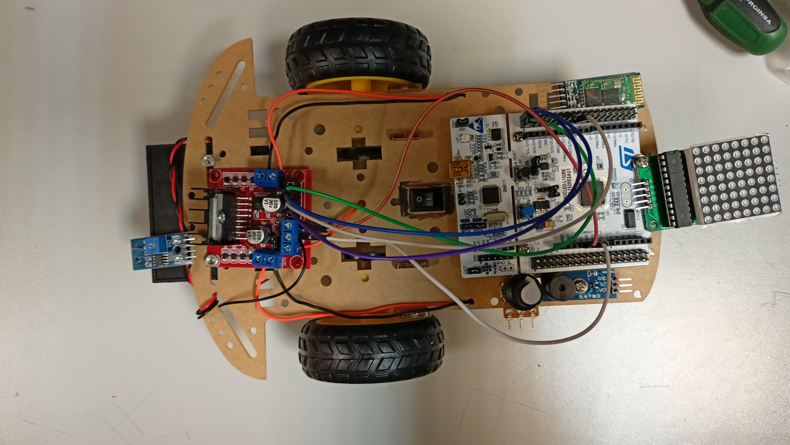

# Design decisions and conventions

This document aims to collect the design decisions and conventions adopted in this project.

## Content <!-- omit in toc -->

* [Components assembly](#components-assembly)
    * [Chassis](#chassis)
    * [Cabling](#cabling)
        * [Color](#color)
* [Implementation](#implementation)
    * [Pin Assignment](#pin-assignment)
    * [User Button](#user-button)
    * [Infrared (IR)](#infrared-ir)
    * [Buzzer](#buzzer)
    * [Motors](#motors)
    * [Potentiometer](#potentiometer)
    * [Green LED](#green-led)
    * [8x8 LED Matrix display](#8x8-led-matrix-display)

## Components assembly

### Chassis

The chassis and its components will be assembled in the following rough configuration:

### Cabling

DuPont cables will be used for the majority of connections, except for power supplies and exceptions such as
permanent connections.

When several cables are connected to the same peripheral or in the same area, it's desirable to have them
bundled. In the case of the original bundles (as provided by the manufacturer), they should be used together
when possible instead of separating the individual cables.

Most DuPont cables will be connected in series to reach a greater length and to simplify connections and
disconnections. The cable connected to the **board** should expose a **female end**, while the cable connected
to the **peripheral** should expose a **male end**. Intermediate cables may be used, but it's not expected to
be necessary.

#### Color

The following color convention will be used for DuPont cables:

|      Color      |       Purpose        |
|:---------------:|:--------------------:|
|      Black      |        Ground        |
|       Red       |      Power (5V)      |
|     Orange      |     Power (12V)      |
| Blue-green pair | Serial communication |
|     Yellow      |    Analog signal     |
|      Gray       | Digital (Left side)  |
|      White      | Digital (Left side)  |
|     Purple      | Digital (Right side) |
|      Blue       | Digital (Right side) |

## Implementation

### Pin Assignment

| PIN  |         Functionality          |
|:----:|:------------------------------:|
| PC6  | Motor Driver IN1 input (left)  |
| PC7  | Motor Driver IN2 input (left)  |
| PC8  | Motor Driver IN3 input (right) |
| PC9  | Motor Driver IN4 input (right) |
| PC1  |          IR Sensor 1           |
| PC2  |          IR Sensor 2           |
| PB8  |             Buzzer             |
| PA4  |         Potentiometer          |
| PB6  |       USART transmission       |
| PB7  |        USART reception         |
| PB1  |        SPI2 Chip Select        |
| PB13 |            SPI2_SCK            |
| PB15 |           SPI2_MOSI            |
| PB10 |  Optocoupler motor left wheel  |
| PB11 | Optocoupler motor right wheel  |
| PC13 |          User button           |
| PA5  |           Green LED            |

### User Button

The user button is the "start" function of the main program. Once it is pressed, after a 2s delay,
the main program will start.

Until the button is pressed, the IR state will be ignored, the motors will be switched off and the buzzer
will not be active.

### Infrared (IR)

There are two IR sensors placed at the front of the car, which will be low when detecting white
and high when detecting black. These changes can be detected using the DO pin coming from the IR
and EXTI callbacks are set up at the specific pins to change internal state variables.

### Buzzer

The buzzer state is defined by the state of the IR sensors.

It can have 3 states:

1. Both IR are low (white) -> buzzer off
2. Only one IR is high (black) -> buzzer playing at an interval of 300ms.
3. Both IR high (black) -> buzzer on continuously

> Note: The *active* buzzer being used is active low, meaning that setting its pin to LOW will make it buzz.
> On top of that, its threshold when powered with 5V is very close to 3.3V (HIGH), so it's unreliable. When
> powered with 3.3V, a 3.3V signal (HIGH) is enough to turn it off.

### Motors

The motors are directly controlled by the IR sensors. If the IR on the same side of the motor is low (white), then
the motor will be on and going forwards. If the IR is high (black), the motor will be stopped.

Additionally, the speed of the motors is controlled by a potentiometer, explained bellow.

### Potentiometer

A potentiometer is used to control the motors speed, with one extreme of the potentiometer will set the
motors speed 50% of the maximum speed and the opposite extreme will set it to 100% of the maximum speed.
Any point in between will directly correlate to a linear value in between 50% and 100%.

### Green LED

The green LED is used to provide feedback through the programs in cases where it can be difficult to know
the state it is in.

> Note: The functionality described bellow is subject to change

Currently, the LED is used to indicate whether the car is functioning in the manual or automatic mode.

### 8x8 LED Matrix display

A MAX7219-driven 8x8 LED matrix is used as a basic multi-purpose display integrated in the car. It is
compatible with SPI communication in 16-bit words (MSB first), with active-low Chip Select, low-at-rest clock
and data shifting on rising CLK edge (CPOL=0, CPHA=0). The last word received (16 bits) is latched on CS
rising edge. The instructions table and other information can be found in the MAX7219 datasheet, as well as
the datasheet for the BxxCDM8 displays, which are very similar to the one used in this project.

The display is connected through the SPI2 peripheral with PB13 as SCK and PB15 as MOSI, plus the PB1 pin as
Chip Select.
