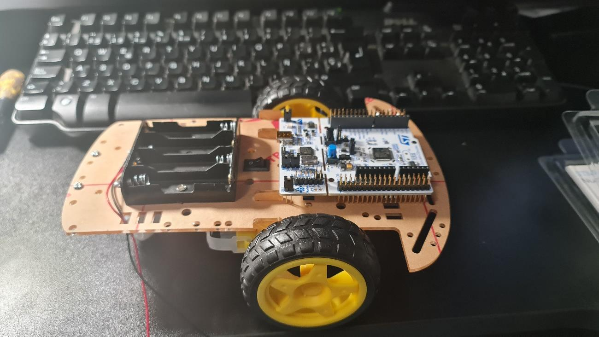
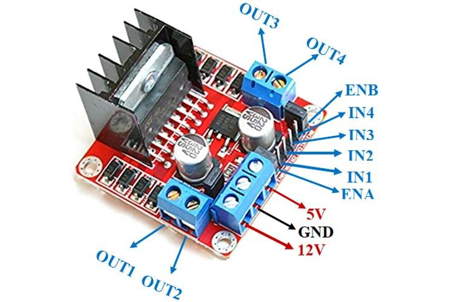
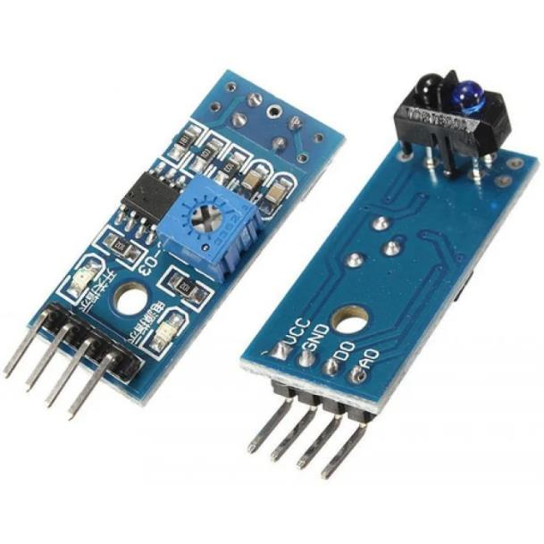
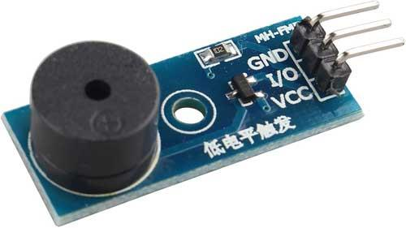

# Laboratory guide of Microprocessor Based Digital Systems

**2nd year, 2nd term**  
**Academic year 2023-2024**

---

## CONTENTS <!-- omit in toc -->

* [1 ORGANIZATION AND EVALUATION](#1-organization-and-evaluation)
* [2 INTRODUCTION](#2-introduction)
* [3 IMPORTANT INDICATIONS IF YOU USE DISCOVERY BOARD](#3-important-indications-if-you-use-discovery-board)
* [4 RECOMMENDATIONS FOR THE LAB PROJECT IMPLEMENTATION](#4-recommendations-for-the-lab-project-implementation)
* [5 LAB PROJECT DEVELOPMENT](#5-lab-project-development)
    * [5.1 SESSION 1 – CONTROL OF MOTORS WITH CONTINUOUS SPEED](#51-session-1--control-of-motors-with-continuous-speed)
    * [5.2 SESSION 2 – LINE DETECTION](#52-session-2--line-detection)
    * [5.3 SESSION 3 – CONTROL OF SPEED AND TURNS](#53-session-3--control-of-speed-and-turns)
    * [5.4 SESSION 4 – COMMUNICATION WITH DEVICES, INTEGRATION AND OPTIONAL IMPROVEMENTS](#54-session-4--communication-with-devices-integration-and-optional-improvements)
* [6 ANNEX 1. LIST OF MATERIAL](#6-annex-1-list-of-material)
* [7 ANNEX 2. PINS DISTRIBUTION AND PORTS CONFIGURATION](#7-annex-2-pins-distribution-and-ports-configuration)
* [8 ANNEX 3. CLARIFICATIONS TO POWER MANAGEMENT AND SERIAL COMMUNICATION](#8-annex-3-clarifications-to-power-management-and-serial-communication)
    * [8.1 AUTONOMOUS POWER MANAGEMENT](#81-autonomous-power-management)
    * [8.2 RECOMMENDATIONS TO DEVELOP THE SERIAL COMMUNICATION](#82-recommendations-to-develop-the-serial-communication)
    * [8.3 COMMUNICATION PROTOCOL](#83-communication-protocol)
    * [8.4 BLUETOOTH](#84-bluetooth)

## 1 ORGANIZATION AND EVALUATION

The work will be carried out in teams. There will be _**4 compulsory laboratory sessions of 2 hours
duration**_. The development of the practice should be worked on before the laboratory sessions.

For the development of the work, one of the following STMicroelectronics development boards will be used,
either Discovery (STM32L152C-Discovery or STM32L-Discovery) or NUCLEO-L152RE. All the documentation on the
microcontroller used and the development boards is available online both on the manufacturer's website and on
Aula Global. Information is provided for both board types as annexes to this manual.

For each practical session, some milestones are proposed to be achieved to guide the development process of
the complete project.

The laboratory evaluation is made up of two parts: **the project grade (60%) and the laboratory exam (40%)**.
The weights of each of the milestones, with respect to the project grade, are as detailed below: **Session 1
(10% of the project), Session 2 (20% of the project), Session 3 (30% of the project), and Session 4 (40% of
the project)**.

**For the evaluation of every session**, each group will upload the source code of their project to AG, at the
end of the laboratory session. In the case of session 4, in addition to the source code of the project, the
group must also upload its documentation and a video demonstrating the functionalities achieved, within a
period of 5 business days from the end of session 4.

Specific instructions regarding these deliveries will be provided through AG.

As for the laboratory exam, it will be individual, and will consist of a written part and an oral part. The
date of said exam is already fixed and the students have been informed by the teachers.

The oral part of the exam will be handled as follows:

* Teachers will call the Lab Groups as required. The rest shall keep silence outside of the Lab.
* Only 2 Lab Groups will be allowed inside the Lab, when one of them will be under the oral examination, while
  the other one will be setting up their project. As soon as one Lab Group finishes the exam, they will pick
  up all their stuff quickly, to allow the following group to enter.
* Lab Groups shall set up their project, leaving it all connected, with the CubeIDE started, with the project
  compiled, and being sure that when calling the debugger, the project will be able to execute the code.
* Students shall bring an extra set of batteries, just in case they run out during the exam
* Everybody in the lab shall keep silence while setting up the project, as not to bother the group being
  evaluated.
* Questions during the oral exam will be fully individual, with all other members of the group standing behind
  the back of the student under examination. No talking, signalling, or any other kind of communication will
  be allowed during the questions to each of the members of the group.
* Each member of the group will be asked one single question, where interaction with the project may be
  required.
    * If the question is answered correctly, a marking parameter C = 1.0
    * If the question is not answered correctly, a new question will be asked:
        * If the 2nd question is answered correctly, C = 0.75
        * If the 2nd question is answered wrongly, C = 0.5
* Once all Lab Group members are evaluated, the Lab Group shall abandon the Lab ASAP and in silence,
  through the back lab door.
* It is expected that the evaluation of each Lab Group may take a maximum of 5 minutes.

The lab exam mark is calculated by multiplying the written part mark by C (as obtained in the oral exam).

If a student fails to attend the lab exam, the continuous evaluation mark will be 0.0.

If the mark achieved by a student in the laboratory exam is not equal or higher than 4, then his/her
laboratory mark (considering both the exam and the lab sessions) will be weighted by 0.45.

**Failure to attend a single laboratory session will mean that the student waives the continuous assessment
(i.e., the continuous evaluation mark will be 0.0).**

**All students involved in any attempt to pass the lab project by copying or any other similar means will
automatically fail the subject**. This rule will be applied both to those students who try to pass the
laboratory project using means other than their own personal effort and to those students who facilitate said
means or help the previous ones.

## 2 INTRODUCTION

The practices are structured so that they end up generating a complete system. In this way, part of what was
developed in one practice will be used in the next practice. This has multiple objectives:

* Learn basic microcontroller programming techniques.
* Learn to design a hardware-software system to meet the requirements of an application.
* Learn to debug and verify the operation of the hardware-software developed.
* Offer an affordable challenge that stimulates the student's capacity for design and innovation.
* Stimulate the capacity for collaboration and participation in a work team.

To carry out the practices, you must use one of the two development boards proposed in the course and also use
additional devices, such as those shown in **[Annex 1](#6-annex-1-list-of-material)**. It is recommended to
use DuPont cables to make the connections.

In the following photo you can see an example of partial assembly, in this case using the NUCLEO plate.

## 3 IMPORTANT INDICATIONS IF YOU USE DISCOVERY BOARD

In this lab project, the LCD of the Discovery board will not be used, and in addition, pins that are
associated with the LCD will have to be used. Therefore, it is essential to deactivate all use of the LCD. To
do this, when creating the project, the following must be taken into account:

* When creating the project, in the CubeMX perspective:
    * Select (on the left) **MULTIMEDIA**
    * Select **LCD**
    * In the Mode sub-window, in the **Mode** entry select **Disable**
* In the code, **do not include the #includes** to the Discovery libraries
* In the code, **do not include LCD function calls**

Also remember:

* Place **JUMPER J1** in the OFF position.
* In the CubeMX perspective, configure the **PC13** in **Reset_State** mode.

## 4 RECOMMENDATIONS FOR THE LAB PROJECT IMPLEMENTATION

Use the available debugging mechanisms to check the correct operation of your solution and, in the event of a
malfunction, to find the source of the errors you can use:

* Step by step execution
* Breakpoints throughout the execution
* Evaluation of variables
* Evaluation of the peripheral registers used.

## 5 LAB PROJECT DEVELOPMENT

The Lab project consists in the development of a robot that is able to follow a black line painted on a white
surface. The functionalities that are sought are the following:

* Mandatory functionalities:
    * Movement forward and backward in a straight line
    * Speed selection
    * Turn to both sides at different angles
    * Checking the existence of the black line under the robot
    * Stop the movement of the robot when the end of the circuit is found
    * Turn the robot to the appropriate direction in order to continue following the line
    * Generate acoustic signals when finishing and when missing the line.
    * Wireless communication with a device (PC or mobile phone), which includes receiving and sending commands
* Optional features:
    * Use of a LED-matrix to show messages/graphics.
    * Measurement of the achieved speed, and its transmission to the connected device (PC or Mobile phone)

The development of the practice will be divided into several steps with intermediate milestones that are
described in the following sections.

In addition, to develop the Lab project, additional material must be acquired, which is listed in
**[Annex 1](#6-annex-1-list-of-material)**.

To facilitate the initial pin assignment task, a table with the pin assignments is available in
**[Annex 2](#7-annex-2-pins-distribution-and-ports-configuration)**. **You SHALL USE those PINs**.

**_It is recommended that you read all the Lab project steps and proposed improvements at the beginning of the
project.**_

Each milestone is designed to be accomplished in a certain lab session. _**To get the maximum score in the
laboratory, the milestones must be reached in the corresponding session**._

### 5.1 SESSION 1 – CONTROL OF MOTORS WITH CONTINUOUS SPEED

During this session, the GPIOs will be used to control the two motors. The main objectives are:

* Perfect the use of GPIOs
* Discover the combination of signals that must be used to move the two wheels in the same direction
* Set up a program in which the robot moves repeatedly as follows:
    * 1 second both wheels stopped
    * 2 seconds both of them forward
    * 1 second both wheels stopped
    * 2 seconds right wheel forward, left wheel backwards
    * 1 second both wheels stopped
    * 2 seconds left wheel forward, right wheel backwards
    * 1 second both wheels stopped
    * 2 seconds both wheels backwards
    * start over

To do this you will have to connect the development board to the motor driver. It is proposed to use the L298N
driver module, which can be seen in the following figure:

<figure> <!-- Figure 1 - L298 module -->
    
    <figcaption>
        Figure 1 -
        <a href="https://components101.com/modules/l293n-motor-driver-module">
            https://components101.com/modules/l293n-motor-driver-module
        </a>
    </figcaption>
</figure>

A simple description of the driver is described in the following:

* In the triple screw terminal:
    * Connect the batteries, with the positive to the left screw terminal (from the edge of the development
      board, 12 V in Figure 1).
    * Connect the ground of all components (including the development board) to the middle screw terminal (GND
      in Figure 1).
    * And a red wire to the right screw terminal, (5V in Figure 1).It could be used to give 5V to other
      components.
* Each double screw terminal is for one of the motors.
* Pins:
    * IN1 & IN2: Pins to control motor A.
        * If IN1 is 1 and IN2 is 0, the motor rotates in one direction.
        * If IN1 is 0 and IN2 is 1, the motor rotates in the opposite direction.
        * If IN1 = IN2 the motor stops.
    * IN3 & IN4: Pins to control motor B, with the same functioning as Motor A.
    * ENA: Enables motor A if the jumper is connected. If the jumper is disconnected, the motor does not work.
    * ENB: Enables motor B in the same way as ENA enables motor A

In this session, the robot can be brought without mounting on the chassis, but this practice will be used to
finish assembling it (mandatory part).

It is recommended to lift the robot wheels, so that the robot never moves on the table, except when the
operation has already been checked. For example, the chassis can be left on a support that leaves the wheels
in the air, or a member of the group can hold it raised by hand, resting on the non-motorized wheel.

_**In this session is not necessary to use interrupts or timers. Timing can be done by wasting clock cycles
using an empty for loop.**_

Milestone evaluation points:

* a) Movement of a wheel in both directions.
* b) Synchronous movement of both wheels.
* c) Asynchronous movement of both wheels in both directions.
* d) Cyclic movement sequence.

### 5.2 SESSION 2 – LINE DETECTION

During this session, the GPIO, timing, and interrupts will be used to control the IR receivers and generate
the acoustic signal.

**From this session on, you should make intensive use of interrupts. That is, whenever possible and it makes
sense, interrupts will be used to control each of the events, devices, et**c.

The fundamental objectives are:

* Read the response of the IR receivers in all possible situations.
* Read the IR response only when relevant (i.e., do not use continuous polling, a.k.a. busy waiting)
* Generate a continuous sound when end of line is found (a black crossing both sides of the line), and
  stopping.
* Generate an intermittent sound when line is lost, and reaction to find it back.

To do this you will have to connect the development board to 2 IR sensors. It is proposed to use the TCR T5000
sensor module, which can be seen in the following figure:

<figure> <!-- Figure 2 - TCR T5000 Module -->
    
    <figcaption>
        Figure 2 -
        <a href="https://robu.in/product/tcrt-5000/">
            https://robu.in/product/tcrt-5000/
        </a>
    </figcaption>
</figure>

A simple description of this device can be found in:
<https://tecnopatafisica.com/tecno3eso/teoria/robotica/104-arduino-sensor-infrarrojos-para-robot-siguelineas>

For the generation of the sound, it is recommended to use an active buzzer, which with a simple logic value
(either a 1 or a 0), sounds. An example is the buzzer in the following figure, where when the circuit is
powered, placing a 0 on the I/O pin sounds:

<figure> <!-- Figure 3 - HC SR04 module -->
    
    <figcaption>
        Figure 3 -
        <a href="https://www.electroschematics.com/hc-sr04-datasheet/">
            https://www.electroschematics.com/hc-sr04-datasheet/
        </a>,
        <a href="https://programarfacil.com/blog/arduino-blog/buzzer-con-arduino-zumbador/">
            https://programarfacil.com/blog/arduino-blog/buzzer-con-arduino-zumbador/
        </a>
    </figcaption>
</figure>

In this session, it is not necessary to make the robot move, but it can be done independently, to later
integrate it into the Session 1 project, during Session 3. If the robot is not made to move, you can check the
correct operation of the session using the hand, so that it gets closer to the ultrasonic sensor and the
corresponding values are discovered.

_**In this session (and in the following ones), times have to be measured exactly, using timers. Therefore, it
is totally forbidden to use the function "wait()" (or equivalent) mentioned throughout the theory lessons.**_

Milestone evaluation points:

* a) Correct reception of the response from the infrared sensor.
* b) Wheel response according to both IR readings.
* c) Continuous sound when end of line is found (a black crossing both sides of the line), and stoping.
* d) Intermittent sound when line is lost, and reaction to find it back.

### 5.3 SESSION 3 – CONTROL OF SPEED AND TURNS

During this session, there will be an intensive use of the Timers, in such a way that, by means of PWM
signals, the speed of the movement of the robot is controlled, both forwards and backwards. Furthermore, this
will be integrated with the results of Session 2. An ADC will also be used.

The main objectives are:

* Get different travel speeds on each of the wheels.

* Execution of turns to both sides, through the different speed between the left and right wheel.
* A potentiometer will be used to control the maximum speed of the robot. One position of the potentiometer
  will mean maximum speed available by the motors. The opposite position of the potentiometer will imply that
  the maximum speed of the robot will be half of the available speed.
* Autonomous functionality of the robot. The robot starts by being stopped. It is placed on the circuit. When
  the user presses the USER BUTTON, the robot stays stopped for 2 seconds, and after that it will start
  following the circuit, at the speed indicated by the potentiometer. The robot will stop when it finds a
  perpendicular black line.

Milestone evaluation points:

* a) Different wheel speeds using PWM.
* b) Modification of the maximum speed of the robot.
* c) Dynamics of movement dependent on the position of the line.
* d) Completion of the whole sampling circuit.

### 5.4 SESSION 4 – COMMUNICATION WITH DEVICES, INTEGRATION AND OPTIONAL IMPROVEMENTS

During this session, asynchronous serial communication will be used, through a USART of the microcontroller.
With this communication, instructions will be given to the robot for its movement and the robot will send
information to the external device about its state.

This will integrate all the components of the practice, which were mostly already integrated in Session 3.
Additionally, a series of optional improvements can be made, which can mean up to 1 additional point in the
final laboratory grade.

The main objectives are:

* Establish a serial communication with an external device (PC or mobile phone). The communication will be
  done using a Bluetooth connection.
    * You can use a Bluetooth transducer such as the HC-05, instead of the serial-USB transducer provided with
      the laboratory material.
        * Information can be found at: <https://aprendiendoarduino.wordpress.com/tag/hc-05/>
    * Communication with a mobile phone can be used. To avoid having to develop your own mobile application, you
      can use a Serial Bluetooth Terminal (such as,
      <https://play.google.com/store/apps/details?id=de.kai_morich.serial_bluetooth_terminal&hl=es> &gl=US) that
      works as a serial terminal and you can also define buttons and functionalities.
* Establish a set of control commands for the robot and check its correct operation.
* Obtain an autonomous robot that can move following a line in a circuit.
* Report back to the external device all movements done.

The communication must include, at least:

* Commands (from the device to the robot):
    * Stop
    * Forward
    * Back
    * Right
    * left
    * Speed setting (0% - 100%). This speed reduction will be applied to the maximum speed selected by the
      potentiometer.
* Responses (from the robot to the device):
    * Starting to move shall be reported, indicating direction, as well as stopping.
    * When finishing the end of the circuit, all movements will be reported back as a sequence to the external
      device.

As mentioned, 2 optional improvements are proposed, which may mean up to 1 additional point in the laboratory
grade, with 50% corresponding to improvement 1, and 50% corresponding to improvement 2:

* Improvement 1: LCD Matrix to show dynamic messages/graphics:
    * You can use an 8x8 LED matrix module, which connects through a synchronous serial interface, such as the
      ones using the controller MAX7219. You can learn about this kind of modules in the following links:
        * <https://programarfacil.com/blog/arduino-blog/matriz-led-arduino-max7219/>
        * <https://projecthub.arduino.cc/mdraber/controlling-8x8-dot-matrix-with-max7219-and-arduino-0c417a>
* Improvement 2: Measurement of the achieved speed and transmission of the speed to the connected device (PC
  or mobile phone).
    * For that functionality you will use rotatory encoders in each motor and optocouplers, connected to the
      microcontroller.
    * Example of the material that can be used can be found at:
      <https://www.amazon.es/dp/B0817FM4BJ/ref=sspa_dk_detail_0?psc=1&pd_rd_i=B0817FM4BJ&pd_rd_w=NlfF0&content-id=amzn1.sym.5211011f-e3fb-4d92-b58e-b3527e67ddff&pf_rd_p=5211011f-e3fb-4d92-b58e-b3527e67ddff&pf_rd_r=69QPD9HPYY4NHQ0WKFM2&pd_rd_wg=7JLba&pd_rd_r=a0b8714f-debb-457a-add4-293753bdfc82&s=electronics&sp_csd=d2lkZ2V0TmFtZT1zcF9kZXRhaWw>

Milestone evaluation points:

* a) Establishment of communication.
* b) Verification of command execution.
* c) Verification of receipt of responses.
* d) Final integration and achievement of the proposed objectives.
* e) Evaluation of improvements for the additional point.

## 6 ANNEX 1. LIST OF MATERIAL

To accomplish the lab Project, the material listed in this annex is required.

**Amazon links are provided as reference so that you can see the component. Be aware that some links will
provide more than one unit of the material (some of them 5).**

The best places to obtain this type of material are the one related to Arduino developments.

* Development board (provided by Electronic Technology Department to the students group):
    * STM32L-Discovery board
    * Mini-USB cable
    * Transducer USART-USB
* Electro-mechanics part: it can be bought in a pack like the one available in the following link:
  <https://www.amazon.es/gp/product/B01LW6A2YU/ref=ppx_yo_dt_b_asin_title_o09_s02?ie=UTF8&psc=1>
    * Pack content, in the case other pack is bought or you want to buy the components:
        * Chassis
        * 2 motors 1:120
        * 2 traction wheels
        * 2 rotary encoders (optional)
        * 1 wheel (free movement)
        * Battery box for 4 AA batteries (we could also use a battery box for a 9V battery)
        * Wires for motors
        * Screws and fixing tape
    * Additional screws
    * 4 AA alkaline batteries
* Electronic part:
    * DuPont wires male to female and female to female:
        * <https://www.amazon.es/gp/product/B09STM4WPB/ref=ppx_yo_dt_b_asin_title_o01_s00?ie=UTF8&psc=1>
    * Motor driver Driver (Driver module L298N):
        * <https://www.amazon.es/gp/product/B07MY33PC9/ref=ppx_yo_dt_b_asin_title_o07_s01?ie=UTF8&psc=1>
    * Infrared sensor TCR T5000 (2 units needed):
        * <https://www.amazon.es/s?k=tcrt5000&crid=22BS33ITODO7E&sprefix=TCR%2Caps%2C97&ref=nb_sb_ss_ts-doa-p_2_3>
    * Active buzzer:
        * <https://www.amazon.es/gp/product/B08CBHXKX2/ref=ppx_yo_dt_b_asin_title_o00_s00?ie=UTF8&psc=1>
    * Potentiometer of 5K or 10K (not multi-turn potentiometer)
    * BlueTooth transducer HC-05:
        * <https://www.amazon.es/gp/product/B07BHRG9KB/ref=ppx_yo_dt_b_asin_title_o06_s00?ie=UTF8&psc=1>
        * Google search: bluetooth hc-05
* Optional part:
    * Development board NUCLEO-L152RE (to use it instead of Discovery):
        * <https://es.farnell.com/stmicroelectronics/nucleo-l152re/placa-nucleo-mcu/dp/2394227?ICID=I-RP-STM7REC-0>
        * Google search: nucleo-l152re
    * 8x8 LED matrix:
        * <https://amzn.eu/d/iyAPk19>
    * Optocouplers for rotatory encoder (2 units needed):
        * <https://www.amazon.es/gp/product/B0B6SPB2C4/ref=ppx_yo_dt_b_asin_title_o04_s00?ie=UTF8&psc=1>

## 7 ANNEX 2. PINS DISTRIBUTION AND PORTS CONFIGURATION

The pins distribution is the following, unless prior approval by the faculty. The distribution will be used for both
Discovery and NUCLEO boards.

| Pin                 | Functionality                 |
|---------------------|-------------------------------|
| PC6                 | Input IN1 of motors Driver    |
| PC7                 | Input IN2 of motors Driver    |
| PC8                 | Input IN3 of motors Driver    |
| PC9                 | Input IN4 of motors Driver    |
| PC1                 | IR sensor 1 output            |
| PC2                 | IR sensor 2 output            |
| PB8                 | Buzzer                        |
| PA5                 | Potentiometer                 |
| PB6                 | USART transmission            |
| PB7                 | USART reception               |
| PB13 (Optional)     | SPI2_SCK                      |
| PB15 (Optional)     | SPI2_MOSI                     |
| PB10 (Optional)     | Optocoupler motor left wheel  |
| PB11 (Optional)     | Optocoupler motor right wheel |
| PA0 (for Discovery) | USER BUTTON                   |
| PC13 (for NUCLEO)   | USER BUTTON                   |

## 8 ANNEX 3. CLARIFICATIONS TO POWER MANAGEMENT AND SERIAL COMMUNICATION

As Session 4 is explained in a very open way, to allow several design decisions to be taken by the students, it
has been considered that some clarifications may be welcomed.

### 8.1 AUTONOMOUS POWER MANAGEMENT

So far, during all previous sessions, you have had the USB cable connected to the board (either the Discovery,
or the NUCLEO). That USB cable, is not only providing communication to the board, but also the power (the +5V
and the +3,3V) to all peripherals, except for the motors (which is given by the driver powered up with the
batteries). During all the lab sessions, you SHOULD NOT HAVE connected the EXT_5V pin of the board to the 5V
output of the driver, as there may be differences in voltage, and therefore short-circuits that may even
damage the board.

During the autonomous behaviour of the robot, you may be tempted to disconnect the cable, as to not fighting
against the USB cable connected to your PC or laptop. Also, in session 4, when you should have implemented the
Bluetooth connection, you may also be tempted to discard the use of the USB cable. In such a case you should
behave as follows:

* Upload the program into the board, by using the "play" button in the STM32CubeIDE.
* Disconnect the USB cable.
* Follow the recommendations given in the User Manual of the Discovery Board UM1079, to connect the external
  power supply (section 4.3, 2nd bullet in page 16 of UM1079). You will be able to provide the 5V from the
  Motor Driver, to the board.
    * For the NUCLEO board, you can find it in clause 6.3.2 (of the manual called NUCLEO64-
      BOARDS-MB1136-STMICROELECTRONICS.PDF:
        * Jumper on JP5 on 2-3
        * Jumper removed on JP1
        * E5V pin (CN7 pin 6) for the +5V and any of the GND pins in any of the connectors, to connect the
          GND.
* When you power up the board (with the power switch connected between the batteries and the motor driver),
  you may press the RESET button in the board to start the program (some boards may even start the program as
  soon as it is power up) – WE RECOMMEND THAT THE STATUS OF THE ROBOT SHOULD BE "STOPPED" AT THE BEGINNING OF
  THE PROGRAM.

### 8.2 RECOMMENDATIONS TO DEVELOP THE SERIAL COMMUNICATION

Do not attempt to solve the serial communication directly. Remember than in communications you never know if
the error may come due to your programming, or due to the lack of communication channel (i.e., the hardware
involved).

So, use the incremental approach that you can find in the USART slides. First try to check if the Tx with
polling works. Once this is working, implement the Rx with polling, and only when you already know that both,
Tx and Rx are working, integrate the interrupts.

If all this is working, then enhance the communication capabilities, by including the required communication
protocol.

Remember that you're also free to choose the communication parameters (e.g., baudrate, etc.).

### 8.3 COMMUNICATION PROTOCOL

You are free to design whatever communication protocol that you may want. Session 4 already states a minimum
number of commands (from the PC to the robot) and responses (from the robot to the PC). You can decide to
implement more commands and/or responses.

In addition, the design of the communication protocol (i.e., the way commands/responses are defined), is up to
you. You may decide, for example, to use a single letter for the command (e.g., F – forward, B – backward,
etc.), or numbers, or multiple byte commands. In the provided video, you can see a simplified protocol using
numbers 1 to 6.

It is important for you to know, that in order to be able to see the responses and type the commands in
TeraTerm, you should use ASCII characters (i.e., instead of a 3, you should send '3' or the hexadecimal
equivalent 0x33).

### 8.4 BLUETOOTH

Before implementing the Bluetooth communication, solve the protocol using the cable.

Once you decide to implement the Bluetooth communication, start also by testing it incrementally, the same way
as we have recommended in 8.2. Once the simple communication is verified, then include the communication
protocol defined in 8.3.

Be aware that the communication parameters may have to be different from the ones you've used in 8.2 and 8.3.
Check the datasheet of the Bluetooth module to discover the communication parameters needed for your module.

Some modules may experience some inconsistencies in the communication, and may need the transmission of a
single character in between commands (as the implementation shown in the video posted).
