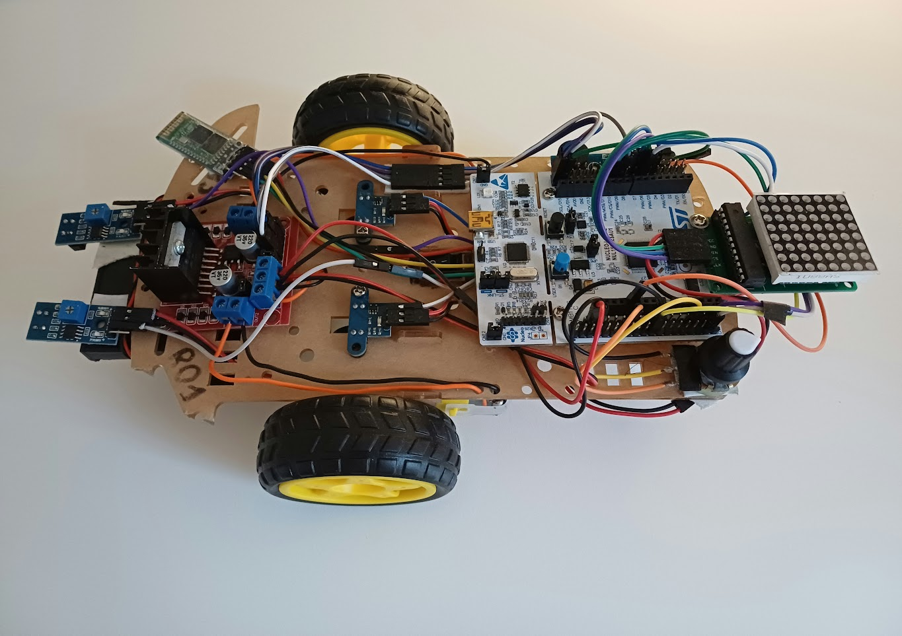
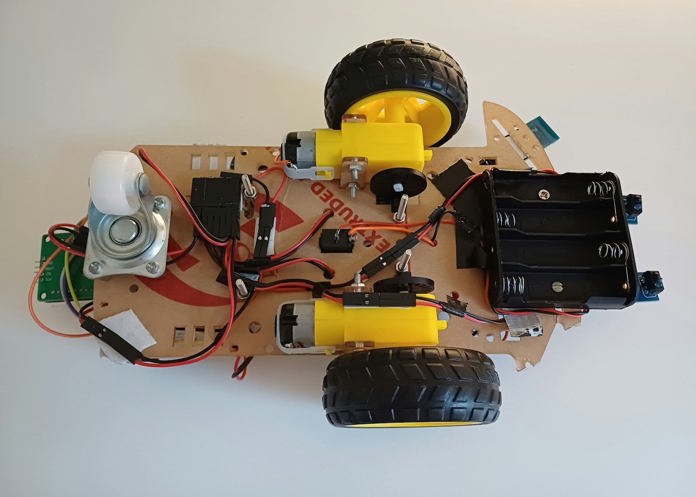

# MBDS Line Follower

This is the source code for the laboratory line follower robot built for the Microprocessor-Based Digital
Systems (Spring 2024), developed by group 1 (station R01)

  
   

## Lab manual

The laboratory manual can be found under [Documentation/lab-guide.md](Documentation/lab_guide.md).

## Design documentation

The design documentation can be found under [Documentation/design.md](Documentation/design.md).

## Code quality

The code must be formatted using [`clang-format`](https://clang.llvm.org/docs/ClangFormat.html)
